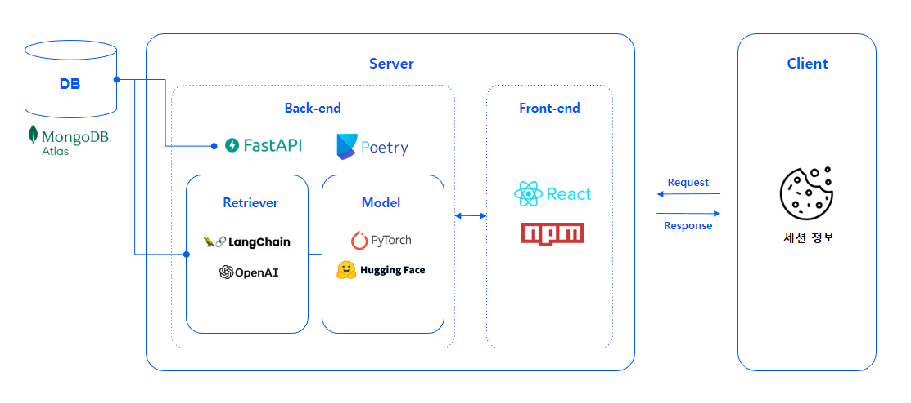
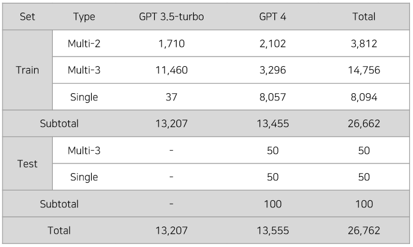
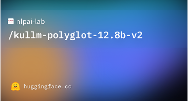
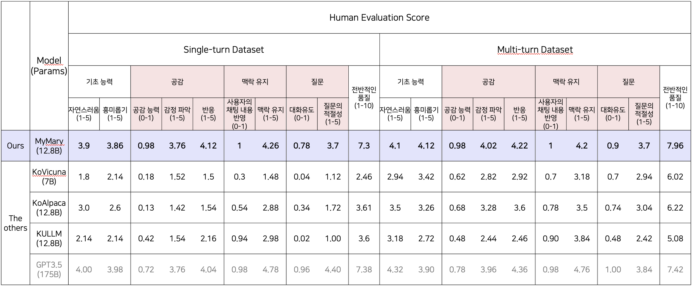
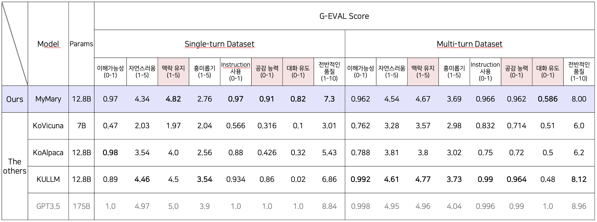

# 내마리(MyMary): 내 마음을 들여다 보는 챗봇
챗봇과의 대화를 통해 ‘나’에 대해 더 잘 알아갈 수 있는 챗봇, '내마리(MyMary)' 서비스입니다.

- 궁극적으로 사용자가 **사용자 자신과 상호작용 하는 (=내 마음을 들여다 보는) 경험을 제공**합니다.
- 사용자와 챗봇 간의 대화가 이어져 사용자의 챗봇 서비스 이용 시간 증가하며, 이는 비즈니스 이익으로 연결됩니다.

## 1. 프로젝트 데모 Project Demo
[링크]()

## 2. 팀 & 역할 Team & Roles
|공통|문지혜|박경택|박지은|송인서|윤지환|
|:---:|:---:|:---:|:---:|:---:|:---:|
|||||||
||[](https://github.com/jihye-moon)|[](https://github.com/afterthougt)|[](https://github.com/iamzieun)|[](https://github.com/fortunetiger)|[](https://github.com/ohilikeit)|
|데이터 생성 및 검수 <br> 모델 별 실험|Evaluation Metric Research <br> Evaluation 전략설계|Prompt Engineering <br> LangChain 연동 <br> 발표|개발환경 구성 <br> Baseline code 작성 <br> 데이터 EDA <br> 발표|LangChain 연동 <br> FE/BE 구현 <br> DB 연결|PM <br> Baseline code 작성 <br> 데이터 취합 및 전처리 <br> LangChain 연동|


## 3. 실행 방법 How-to-Run
### Finetuning
```bash
python finetuning/train.py
```

### Merge QLoRA layer into LLM backbone
```bash
python finetuning/merge_lora.py
```

### Inference
```bash
python finetuning/inference.py
```

## 4. 프로젝트 아키텍처 Project Architecture


## 5. 데이터 Data

- [HuggingFace 데이터셋 리포지토리](https://huggingface.co/datasets/ohilikeit/empathetic_dialogues_kr)
- 공감형 대화 공개 데이터셋은 싱글-턴(single-turn) 데이터 8,194개와 멀티-턴(multi-turn) 데이터 18,668개로 구성됩니다.
- 사용자의 채팅에 대한 응답인 챗봇의 채팅은 '공감형 반응 - 질문' 형태를 띱니다.
- 파인튜닝 시 모델의 입력은 프롬프트 템플릿으로 감싸주었습니다.

## 6. 모델 Model
### Backbone
#### KULLM-Polyglot-Ko-12.8B


Polyglot-Ko-12.8B 모델을 backbone으로 하여 15만 2천여 건의 싱글-턴 대화로 fine-tuning한 모델입니다.

### QLoRA layer


LoRA 기법에 4-bit quantization, double quantization, paged optimizer 등의 방법을 사용하여 VRAM 32GB single GPU에서 full finetuning이 가능하게 했습니다.

## 7. 평가 Evaluation
### Human Evaluation
평가 항목은 크게 (1) 기초 능력, (2) 공감, (3) 맥락 유지, (4) 질문 항목으로 나뉩니다.


### G-Eval
G-eval 논문을 참고하여 6가지 항목을 선정하고, 추가적으로 (1) 공감 능력, (2) 대화 유도 항목을 추가하여 평가하였습니다.


## 8. 서빙 Serving
[README](https://github.com/boostcampaitech5/level3_nlp_finalproject-nlp-12/server/README.md)

## 9. 공개 링크 Public Links
[Presentation]() | [Wrap-up Report]()

## 10. Reference
- [A Technical Report for Polyglot-Ko: Open-Source Large-Scale Korean Language Models](https://arxiv.org/abs/2306.02254)
- [GPT-NeoX-20B: An Open-Source Autoregressive Language Model](https://arxiv.org/abs/2204.06745)
- [Few-Shot Parameter-Efficient Fine-Tuning is Better and Cheaper than In-Context Learning](https://arxiv.org/abs/2205.05638)
- [LoRA: Low-Rank Adapatation of Large Language Models](https://arxiv.org/abs/2106.09685)
- [QLoRA: Efficient Finetuning of Quantized LLMs](https://arxiv.org/abs/2305.14314)
- [G-Eval: NLG Evaluation using GPT-4 with Better Human Alignment](https://arxiv.org/abs/2303.16634)