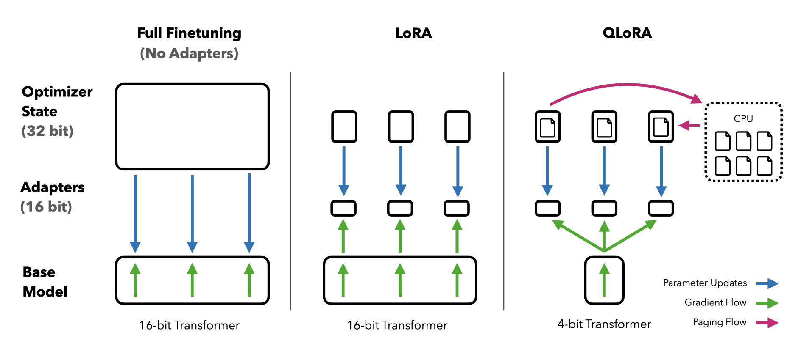

# 내마리(MyMary): 내 마음을 들여다 보는 챗봇
챗봇과의 대화를 통해 ‘나’에 대해 더 잘 알아갈 수 있는 챗봇, `내마리(MyMary)` 서비스입니다.
`내마리(MyMary)`는
- 사용자의 채팅 속에서 **맥락을 파악**하고 사용자에게 **따뜻한 공감**을 제공하며
- 질문 또는 생각 정리의 형식으로 사용자의 채팅에 대한 답변을 마무리함으로써
- 사용자가 **공감을 기반으로 챗봇과 상호작용**할 수 있게 되어, 궁극적으로 **사용자 자신과 상호작용 하는 (= 내 마음을 들여다보는) 경험**을 제공합니다.

[[**마리와 대화하기**](http://mymary.o-r.kr:30007)]

## 1. 프로젝트 데모 Project Demo


## 2. 팀 & 역할 Team & Roles
|공통|문지혜|박경택|박지은|송인서|윤지환|
|:---:|:---:|:---:|:---:|:---:|:---:|
|||||||
||[](https://github.com/jihye-moon)|[](https://github.com/afterthougt)|[](https://github.com/iamzieun)|[](https://github.com/fortunetiger)|[](https://github.com/ohilikeit)|
|데이터 생성 <br> 데이터 검수 <br> 모델 별 실험|평가 지표 리서치 <br> 평가 전략 설계|프롬프트 엔지니어링 <br> LangChain 연동 <br> 발표|개발환경 구성 <br> 베이스라인 작성 <br> 데이터 EDA <br> 발표|FE/BE 구현 <br> DB 연결 <br> LangChain 연동|**PM** <br> 베이스라인 작성 <br> 데이터 취합 <br> 데이터 전처리 <br> LangChain 연동|


## 3. 실행 방법 How-to-Run
### Dependency Management
```bash
poetry shell
```

### Finetuning
`finetuning` 디렉토리에서
```bash
python train.py
```

### Merge QLoRA layer into LLM backbone
`finetuning` 디렉토리에서
```bash
python merge_lora.py
```

### Inference
`finetuning` 디렉토리에서
```bash
python inference.py
```

### Server
#### Backend
`server/backend` 디렉토리에서
```bash
python app.py
```

#### Frontend
`server/frontend` 디렉토리에서
```bash
npm install
```
and
```bash
npm start
```

## 4. 프로젝트 아키텍처 Project Architecture


## 5. 데이터 Data


- [HuggingFace 데이터셋 리포지토리](https://huggingface.co/datasets/ohilikeit/empathetic_dialogues_kr)
- 공감형 대화 공개 데이터셋은 single-turn 데이터 8,194개와 multi-turn 데이터 18,668개로 구성됩니다.
- 사용자의 채팅에 대한 응답인 챗봇의 채팅은 '공감형 반응 - 질문' 형태를 띱니다.
- Finetuning 시 모델의 입력은 프롬프트 템플릿으로 감싸주었으며, 데이터 생성 및 파인튜닝, 추론 등에서 사용한 프롬프트 템플릿은 [`data/prompt/`](https://github.com/boostcampaitech5/level3_nlp_finalproject-nlp-12/data/prompt) 디렉토리를 참고해주세요.

## 6. 모델 Model
### Backbone
#### KULLM-Polyglot-Ko-12.8B


Polyglot-Ko-12.8B 모델을 backbone으로 하여 15만 2천여 건의 싱글-턴 대화로 finetuning한 모델입니다.

### QLoRA layer


LoRA 기법에 4-bit quantization, double quantization, paged optimizer 등의 방법을 사용하여 VRAM 32GB single GPU에서 full finetuning이 가능하게 했습니다.

## 7. 평가 Evaluation
평가를 위해 비교한 모델은 한국어 LLM 3가지(모델 파라미터수 7B, ~13B)와 현재 서비스 중인 GPT-3.5 모델(모델 파라미터 수 175B)입니다.

### G-Eval
G-eval 논문을 참고하여 6가지 항목을 선정하고, 추가적으로 (1) 공감 능력, (2) 대화 유도 항목을 추가하여 평가하였습니다.


### Human Evaluation
평가 항목은 크게 (1) 기초 능력, (2) 공감, (3) 맥락 유지, (4) 질문 항목으로 나뉩니다. 각각의 항목은 다시 두세 항목으로 세분류하여 평가를 진행하였습니다.


## 8. 서빙 Serving
서빙 파트의 자세한 내용은 `server/` 디렉토리의 [README](https://github.com/boostcampaitech5/level3_nlp_finalproject-nlp-12/server/README.md)를 참고해주세요.

## 9. 공개 링크 Public Links
[Presentation](docs/[최종]NLP_12조_내마리%20내%20마음을%20들여다%20보는%20챗봇.pdf)

## 10. 참고문헌 Reference
- [A Technical Report for Polyglot-Ko: Open-Source Large-Scale Korean Language Models](https://arxiv.org/abs/2306.02254)
- [GPT-NeoX-20B: An Open-Source Autoregressive Language Model](https://arxiv.org/abs/2204.06745)
- [Few-Shot Parameter-Efficient Fine-Tuning is Better and Cheaper than In-Context Learning](https://arxiv.org/abs/2205.05638)
- [LoRA: Low-Rank Adapatation of Large Language Models](https://arxiv.org/abs/2106.09685)
- [QLoRA: Efficient Finetuning of Quantized LLMs](https://arxiv.org/abs/2305.14314)
- [G-Eval: NLG Evaluation using GPT-4 with Better Human Alignment](https://arxiv.org/abs/2303.16634)